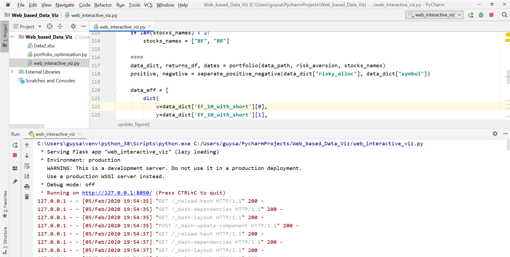

-  If you only want **to get  a static view of our interactive tool** , just download and open the htm file (**Static_view_of_my_interactive_webpage.html**) in your browser (we recommend chrome). 
- To get an **interactive webpage** you can do it in two different ways : using our Software (**"MIPOpti"**), this is the easiest way, or using our python scripts
  - **Using our Software** : Download the **web_interactive_viz.zip** from the  **"releases"** section of this repository : https://github.com/MivieMng/Web-based-Interactive-visualization-of-Portfolio-optimization-results/releases. Unzip it in your local directory, and you will find inside the unzipped file the Software called **"MIPOpti"**, just click on it, it will open a windows terminal and print you a local "web address"  that you should copy into your browser (chrome is recommended), and then you will get an interactive webpage. After the windows terminal has popped up you may wait a few minutes before seeing the local address, the speed depends on your harddware.
  - **Using our python scripts** : you need to read the sections **Installation**  and **Usage of the Web-based application**.

# Web-based Interactive visualization of the results of a Portfolio optimization
This project builds a webpage for an interactive visualization of the results obtained through the optimization of a portfolio of up to 10 assets. This project was an assignement for the course on Data Visualization that I followed during the 2019-2020 accademic year.\
The input data are monthly returns of 10 stocks ("COG", "BR", "CPB", "CHRW", "COF", "CAH", "KORS", "CDNS", "BF", "KMX"), provided in the excel file : **Data.xlsx**. We downloaded the data from https://wrds-www.wharton.upenn.edu/, one can select more than 10 stocks and build his or her own **Data.xlsx**.

Five interactive graphs are produced : 
- **the monthly returns of the individual stocks**,
- **the Covariance Matrix**, 
- **the risk-return  : the Efficient Frontier, the Capital Allocation Line and the points showing individual stocks**, 
- **the allocation of a capital of 10k€ between the risky stocks and one risk-free stock**.

# Features
The main features of this project are : 
## Inputs 
- The **assets to be optimized are chosen inside the webpage**, the minimum number of assets is two. A check box is proposed for each asset.
- The **risk aversion can be chosen inside the webpage**, it ranges from 1 to 10, the default value is 3. The risk aversion affects the capital allocation between risky and risk-free assets. The higher the risk aversion the more the model tends to invest in the risk-free asset.
## Outputs  : 
- The user can **interact with the graphs**. One can perform operations like zoom in and out, displaying values of single data points, removing the graphs of some assets and only keeping the one needed for your analysis, etc.
- Changing the number of **assets to be optmized** may change the following figures:  
  - **the monthly returns of the individual stocks** : is always changed
  - **the Efficient Frontier and the Capital Allocation Line** depend on the impact of the removed or added stocks, while the              points representing the **individual stocks** are proportional to the number of stocks.
  - **the allocation of a capital of 10k€ between the risky stocks and one risk-free stock** : is always changed
- Changing the **risk aversion** will only change the figure for **the allocation of a capital of 10k€ between the risky stocks and one risk-free stock**
- We decided not to change the Covariance matrix based on the inputs, so that the user always has a view of all correlations. 

# Description of the main ingredients of this project 
## Data processing 
The data downloaded from the website needed to be processed. Our processing function can perform the following two operations :
- The time period of the 10 stocks do not run over the same time interval. The processing function finds the intersection between the dates of the 10 stocks, because the time series must have the same length.
-  Sometimes in the downloaded file you can find some string characters (i.e. "C"), in our case we found the character "C" in the returns data of some stocks. The removal of such characters is performed by our processing function.

## Portfolio optimization
We used the library cvxopt (http://cvxopt.org/) to compute the efficient frontier. This library requires the user to define the optimization problem. In our case we defined the problem of optimizing a portfolio with the short sell constraint. The optimization problem actually consists in finding the best combination of the assets that offer the best sharp ratio. 

## Visualization
We used two visualization libraries that belong to the same company. The library "plotly" (https://plot.ly/) creates interactive plots, while the library "Dash" (https://plot.ly/dash/) creates web-based interactive plots (using plotly). We interfaced our optimization tools with these libraries to obtain a web-based interactive visualization of the results of a portfolio optimization.

# Installation

This project was developed using python 3.6, but versions from python 3.5 and greater should work as well. To install all the required lirbaries and their dependencies, we provide the file **requirements.txt** located inside the folder **Web_based_Data_Viz**.

you only need to type in your virtual environment (or in the anaconda prompt if you're using Anaconda): 
**pip install  requirements.txt**.

# Usage of the Web-based application
Here are the keys steps : 

- download this repository and run the main script **"web_interactive_viz.py"**, either using an IDE like pycharm (or spyder) or using command line (in virtual environment),
- after running **"web_interactive_viz.py"**, a **local web address** will be displayed on your terminal (cmd or IDE).
- more than one address can appear, you must click on the **local address**  or copy it to your browser (i.e Chrome).

# Examples : 
### what you get after running the main script "web_interactive_viz.py" 

### what you get after clicking on or pasting the local address (into your browser) : 
**This is a static view of what the interactive webpage looks like, or just see the images below.**
you can click the on the figures to get a better view

## Authors

**Mivie Mangoueleh**

## License

This project is licensed under the MIT License - see the [LICENSE.md](LICENSE.md) file for details
